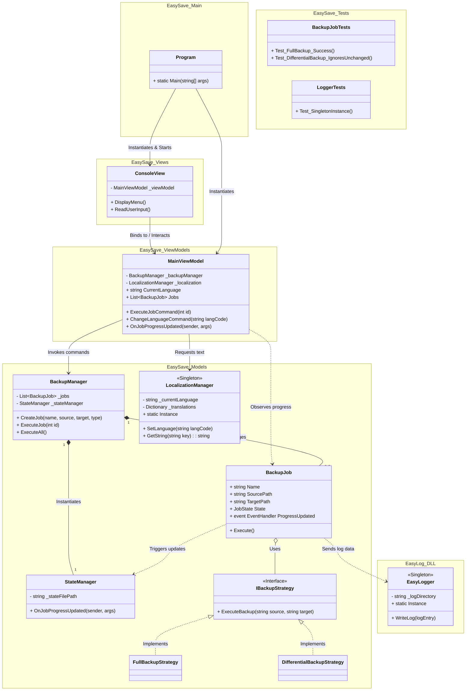

```mermaid
classDiagram
    %% Namespaces grouping for logical separation
    namespace EasySave_Main {
        class Program {
            + static Main(string[] args)
        }
    }
    namespace EasySave_Views {
        class ConsoleView {
            - MainViewModel _viewModel
            + DisplayMenu()
            + ReadUserInput()
        }
    }

    namespace EasySave_ViewModels {
        class MainViewModel {
            - BackupManager _backupManager
            - LocalizationManager _localization
            + string CurrentLanguage
            + List~BackupJob~ Jobs
            + ExecuteJobCommand(int id)
            + ChangeLanguageCommand(string langCode)
            + OnJobProgressUpdated(sender, args)
        }
    }

    namespace EasySave_Models {
        class BackupManager {
            - List~BackupJob~ _jobs
            - StateManager _stateManager
            + CreateJob(name, source, target, type)
            + ExecuteJob(int id)
            + ExecuteAll()
        }

        class BackupJob {
            + string Name
            + string SourcePath
            + string TargetPath
            + JobState State
            + event EventHandler ProgressUpdated
            + Execute()
        }

        class StateManager {
            - string _stateFilePath
            + OnJobProgressUpdated(sender, args)
        }

        class LocalizationManager {
            <<Singleton>>
            - string _currentLanguage
            - Dictionary _translations
            + static Instance
            + SetLanguage(string langCode)
            + GetString(string key) : string
        }

        class IBackupStrategy {
            <<Interface>>
            + ExecuteBackup(string source, string target)
        }
        class FullBackupStrategy
        class DifferentialBackupStrategy
    }

    namespace EasyLog_DLL {
        class EasyLogger {
            <<Singleton>>
            - string _logDirectory
            + static Instance
            + WriteLog(logEntry)
        }
    }

    namespace EasySave_Tests {
        class BackupJobTests {
            + Test_FullBackup_Success()
            + Test_DifferentialBackup_IgnoresUnchanged()
        }
        class LoggerTests {
            + Test_SingletonInstance()
        }
    }

    %% Relationships
    ConsoleView --> MainViewModel : Binds to / Interacts
    MainViewModel --> BackupManager : Invokes commands
    MainViewModel --> LocalizationManager : Requests text
    MainViewModel ..> BackupJob : Observes progress

    BackupManager "1" *-- "1" StateManager : Instantiates
    BackupManager "1" *-- "0..5" BackupJob : Manages
    BackupJob o-- IBackupStrategy : Uses
    IBackupStrategy <|.. FullBackupStrategy : Implements
    IBackupStrategy <|.. DifferentialBackupStrategy : Implements
    
    BackupJob ..> StateManager : Triggers updates
    BackupJob ..> EasyLogger : Sends log data

    Program --> ConsoleView : Instantiates & Starts
    Program --> MainViewModel : Instantiates
```