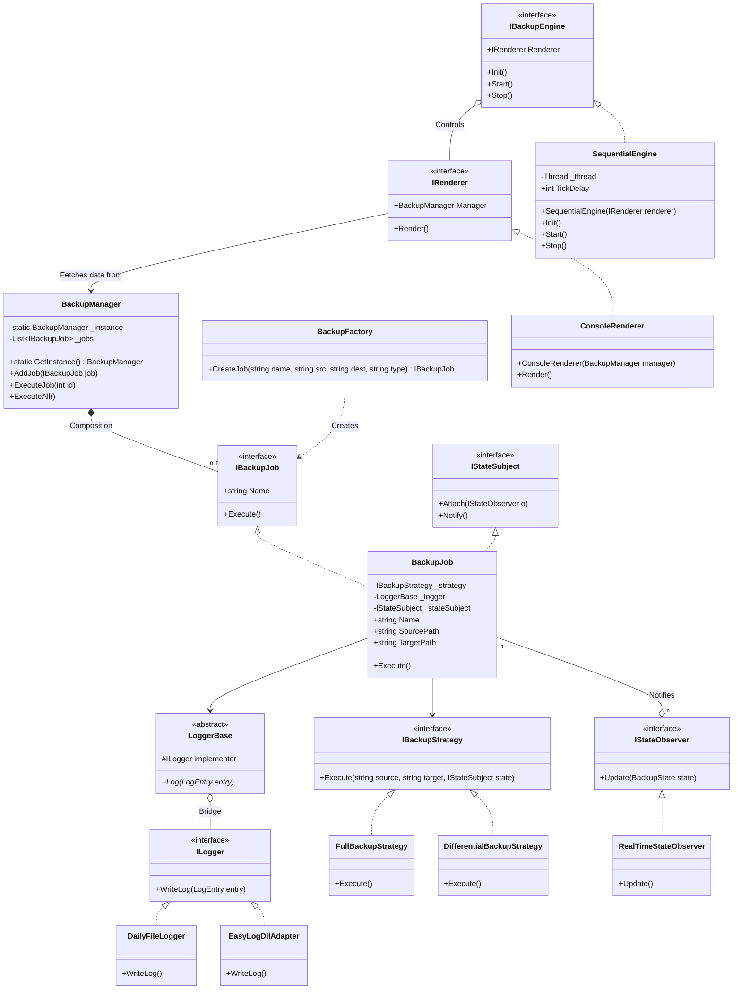

```mermaid
classDiagram
%% ==============================
%% INTERFACES & ABSTRACTIONS
%% ==============================
class IBackupJob {
    <<interface>>
    +string Name
    +Execute()
}

class IBackupStrategy {
    <<interface>>
    +Execute(string source, string target, IStateSubject state)
}

%% BRIDGE PATTERN: Logger Abstraction
class LoggerBase {
    <<abstract>>
    #ILogger implementor
    +Log(LogEntry entry)*
}

class ILogger {
    <<interface>>
    +WriteLog(LogEntry entry)
}

%% ==============================
%% CORE IMPLEMENTATION
%% ==============================
class BackupJob {
    -IBackupStrategy _strategy
    -LoggerBase _logger
    -IStateSubject _stateSubject
    +string Name
    +string SourcePath
    +string TargetPath
    +Execute()
}
IBackupJob <|.. BackupJob

class FullBackupStrategy { +Execute() }
class DifferentialBackupStrategy { +Execute() }
IBackupStrategy <|.. FullBackupStrategy
IBackupStrategy <|.. DifferentialBackupStrategy
BackupJob --> IBackupStrategy

class DailyFileLogger { +WriteLog() }
class EasyLogDllAdapter { +WriteLog() }
ILogger <|.. DailyFileLogger
ILogger <|.. EasyLogDllAdapter
LoggerBase o-- ILogger : Bridge
BackupJob --> LoggerBase

%% ==============================
%% PATTERNS: SINGLETON & FACTORY
%% ==============================
class BackupManager {
    -static BackupManager _instance
    -List~IBackupJob~ _jobs
    +static GetInstance() BackupManager
    +AddJob(IBackupJob job)
    +ExecuteJob(int id)
    +ExecuteAll()
}

class BackupFactory {
    +CreateJob(string name, string src, string dest, string type) IBackupJob
}

BackupManager "1" *-- "0..5" IBackupJob : Composition
BackupFactory ..> IBackupJob : Creates

%% ==============================
%% OBSERVER PATTERN
%% ==============================
class IStateSubject {
    <<interface>>
    +Attach(IStateObserver o)
    +Notify()
}

class IStateObserver {
    <<interface>>
    +Update(BackupState state)
}

class RealTimeStateObserver { +Update() }
IStateObserver <|.. RealTimeStateObserver
IStateSubject <|.. BackupJob
BackupJob "1" --o "n" IStateObserver : Notifies

%% ==============================
%% RENDERER (UI Display)
%% ==============================
class IRenderer {
    <<interface>>
    +BackupManager Manager
    +Render()
}

class ConsoleRenderer {
    +ConsoleRenderer(BackupManager manager)
    +Render()
}

IRenderer <|.. ConsoleRenderer
IRenderer --> BackupManager : Fetches data from

%% ==============================
%% ENGINE (Execution Flow)
%% ==============================
class IBackupEngine {
    <<interface>>
    +IRenderer Renderer
    +Init()
    +Start()
    +Stop()
}

class SequentialEngine {
    -Thread _thread
    +int TickDelay
    +SequentialEngine(IRenderer renderer)
    +Init()
    +Start()
    +Stop()
}

IBackupEngine <|.. SequentialEngine
IBackupEngine o-- IRenderer : Controls
```