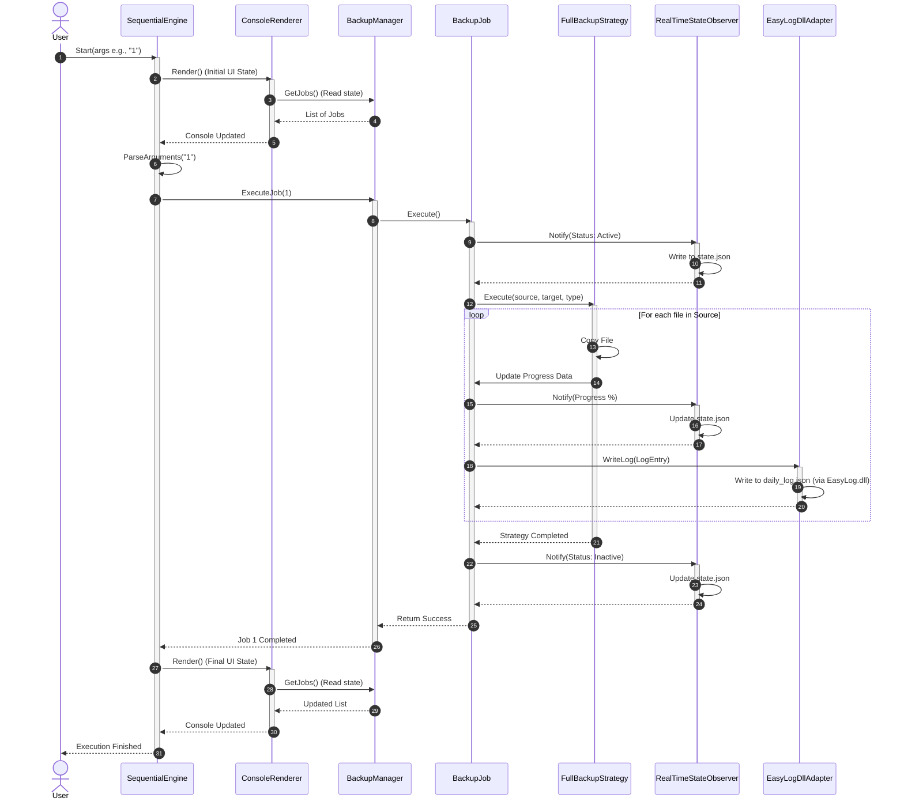

```mermaid
sequenceDiagram
    autonumber
    actor User
    participant Engine as SequentialEngine
    participant Render as ConsoleRenderer
    participant BM as BackupManager
    participant Job as BackupJob
    participant Strat as FullBackupStrategy
    participant Obs as RealTimeStateObserver
    participant Log as EasyLogDllAdapter

    User->>Engine: Start(args e.g., "1")
    activate Engine
    
    %% Engine Initialization Phase
    Engine->>Render: Render() (Initial UI State)
    activate Render
    Render->>BM: GetJobs() (Read state)
    BM-->>Render: List of Jobs
    Render-->>Engine: Console Updated
    deactivate Render

    Engine->>Engine: ParseArguments("1")
    
    %% Execution Phase
    Engine->>BM: ExecuteJob(1)
    activate BM
    BM->>Job: Execute()
    activate Job
    
    %% Observer Notification (Start)
    Job->>Obs: Notify(Status: Active)
    activate Obs
    Obs->>Obs: Write to state.json
    Obs-->>Job: 
    deactivate Obs
    
    %% Strategy & Bridge Pattern in Action
    Job->>Strat: Execute(source, target, type)
    activate Strat
    
    loop For each file in Source
        Strat->>Strat: Copy File
        Strat->>Job: Update Progress Data
        
        Job->>Obs: Notify(Progress %)
        activate Obs
        Obs->>Obs: Update state.json
        Obs-->>Job: 
        deactivate Obs
        
        Job->>Log: WriteLog(LogEntry)
        activate Log
        Log->>Log: Write to daily_log.json (via EasyLog.dll)
        Log-->>Job: 
        deactivate Log
    end
    
    Strat-->>Job: Strategy Completed
    deactivate Strat
    
    %% Observer Notification (End)
    Job->>Obs: Notify(Status: Inactive)
    activate Obs
    Obs->>Obs: Update state.json
    Obs-->>Job: 
    deactivate Obs
    
    Job-->>BM: Return Success
    deactivate Job
    BM-->>Engine: Job 1 Completed
    deactivate BM
    
    %% Final UI Update
    Engine->>Render: Render() (Final UI State)
    activate Render
    Render->>BM: GetJobs() (Read state)
    BM-->>Render: Updated List
    Render-->>Engine: Console Updated
    deactivate Render
    
    Engine-->>User: Execution Finished
    deactivate Engine
```