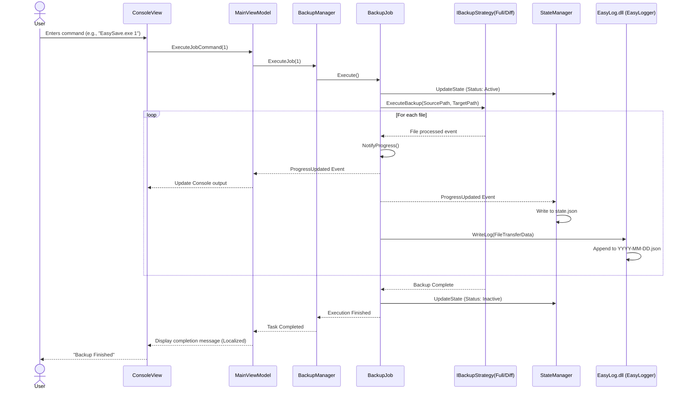

```mermaid
sequenceDiagram
    actor User
    participant View as ConsoleView
    participant VM as MainViewModel
    participant Manager as BackupManager
    participant Job as BackupJob
    participant Strategy as IBackupStrategy(Full/Diff)
    participant State as StateManager
    participant Logger as EasyLog.dll (EasyLogger)

    User->>View: Enters command (e.g., "EasySave.exe 1")
    View->>VM: ExecuteJobCommand(1)
    VM->>Manager: ExecuteJob(1)
    Manager->>Job: Execute()
    
    Job->>State: UpdateState (Status: Active)
    
    Job->>Strategy: ExecuteBackup(SourcePath, TargetPath)
    
    loop For each file
        Strategy-->>Job: File processed event
        Job->>Job: NotifyProgress()
        
        %% Observer pattern in action
        Job-->>VM: ProgressUpdated Event
        VM-->>View: Update Console output
        Job-->>State: ProgressUpdated Event
        State->>State: Write to state.json
        
        %% Logging pattern
        Job->>Logger: WriteLog(FileTransferData)
        Logger->>Logger: Append to YYYY-MM-DD.json
    end
    
    Strategy-->>Job: Backup Complete
    Job->>State: UpdateState (Status: Inactive)
    Job-->>Manager: Execution Finished
    Manager-->>VM: Task Completed
    VM-->>View: Display completion message (Localized)
    View-->>User: "Backup Finished"
```