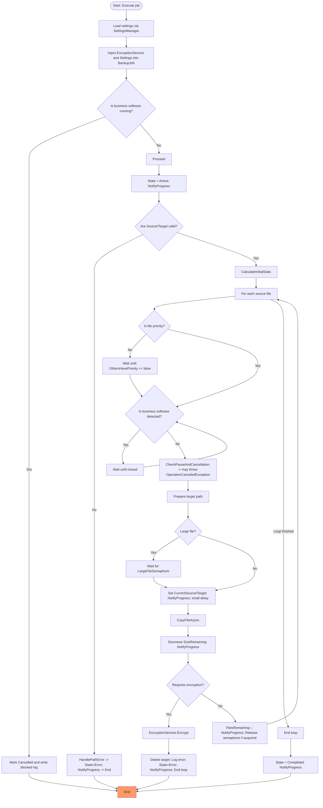

# Activity Diagram - Backup Execution (Mermaid)

```mermaid
flowchart TD
  Start([Start: Execute job])
  A[Load settings via SettingsManager]
  B[Inject EncryptionService and Settings into BackupJob]
  C{Is business software running?}
  C_no[Proceed]
  C_yes[Mark Cancelled and write blocked log]
  D[State = Active; NotifyProgress]
  E{Are Source/Target valid?}
  E_no[HandlePathError -> State=Error; NotifyProgress -> End]
  E_yes[CalculateInitialStats]
  LoopStart[For each source file]
  P1{Is file priority?}
  WaitPriority[Wait until OthersHavePriority == false]
  P2{Is business software detected?}
  WaitBusiness[Wait until closed]
  CheckCancel[CheckPauseAndCancellation -> may throw OperationCanceledException]
  PreparePath[Prepare target path]
  LargeFile?{Large file?}
  WaitSem[Wait for LargeFileSemaphore]
  UpdateCurrent[Set CurrentSource/Target; NotifyProgress; small delay]
  Copy[CopyFileAsync]
  DuringCopy[Decrease SizeRemaining; NotifyProgress]
  Encrypt?{Requires encryption?}
  CallEncrypt[EncryptionService.Encrypt]
  EncryptFail[Delete target; Log error; State=Error; NotifyProgress; End loop]
  AfterFile[FilesRemaining--; NotifyProgress; Release semaphore if acquired]
  LoopEnd[End loop]
  Complete[State = Completed; NotifyProgress]

  Start --> A --> B --> C
  C -- Yes --> C_yes --> End
  C -- No --> C_no --> D --> E
  E -- No --> E_no --> End
  E -- Yes --> E_yes --> LoopStart
  LoopStart --> P1
  P1 -- No --> WaitPriority --> P2
  P1 -- Yes --> P2
  P2 -- Yes --> WaitBusiness --> P2
  P2 -- No --> CheckCancel --> PreparePath --> LargeFile?
  LargeFile? -- Yes --> WaitSem --> UpdateCurrent
  LargeFile? -- No --> UpdateCurrent
  UpdateCurrent --> Copy --> DuringCopy --> Encrypt?
  Encrypt? -- Yes --> CallEncrypt --> EncryptFail
  Encrypt? -- No --> AfterFile
  EncryptFail --> End
  AfterFile --> LoopStart
  LoopStart -->|Loop finished| LoopEnd --> Complete --> End

  style End fill:#f96
```
