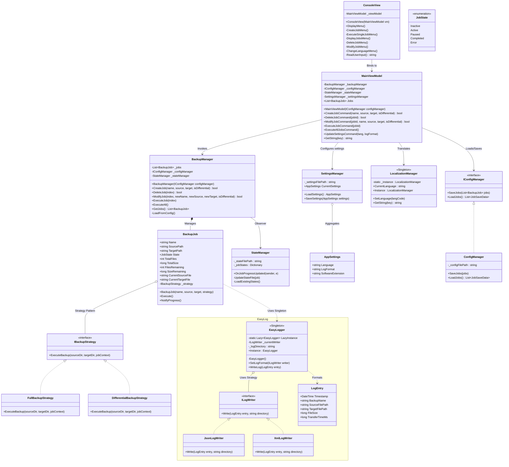

```mermaid
    classDiagram
    %% ==============================
    %% VIEW LAYER
    %% ==============================
    class ConsoleView {
        -MainViewModel _viewModel
        +ConsoleView(MainViewModel vm)
        +DisplayMenu()
        -CreateJobMenu()
        -ExecuteSingleJobMenu()
        -DisplayJobsMenu()
        -DeleteJobMenu()
        -ModifyJobMenu()
        -ChangeLanguageMenu()
        -ReadUserInput() string
    }

    %% ==============================
    %% VIEWMODEL LAYER
    %% ==============================
    class MainViewModel {
        -BackupManager _backupManager
        -IConfigManager _configManager
        -StateManager _stateManager
        -SettingsManager _settingsManager
        +List~BackupJob~ Jobs
        +MainViewModel(IConfigManager configManager)
        +CreateJobCommand(name, source, target, isDifferential) bool
        +DeleteJobCommand(jobId) bool
        +ModifyJobCommand(jobId, name, source, target, isDifferential) bool
        +ExecuteJobCommand(jobId)
        +ExecuteAllJobsCommand()
        +UpdateSettingsCommand(lang, logFormat)
        +GetString(key) string
    }

    %% ==============================
    %% MODEL LAYER - CORE & SETTINGS
    %% ==============================
    class SettingsManager {
        -_settingsFilePath : string
        +AppSettings CurrentSettings
        +LoadSettings() AppSettings
        +SaveSettings(AppSettings settings)
    }

    class AppSettings {
        +string Language
        +string LogFormat
        +string SoftwareExtension
    }

    class BackupManager {
        -List~BackupJob~ _jobs
        -IConfigManager _configManager
        -StateManager _stateManager
        +BackupManager(IConfigManager configManager)
        +CreateJob(name, source, target, isDifferential) bool
        +DeleteJob(index) bool
        +ModifyJob(index, newName, newSource, newTarget, isDifferential) bool
        +ExecuteJob(index)
        +ExecuteAll()
        +GetJobs() List~BackupJob~
        -LoadFromConfig()
    }

    class BackupJob {
        +string Name
        +string SourcePath
        +string TargetPath
        +JobState State
        +int TotalFiles
        +long TotalSize
        +int FilesRemaining
        +long SizeRemaining
        +string CurrentSourceFile
        +string CurrentTargetFile
        -IBackupStrategy _strategy
        +BackupJob(name, source, target, strategy)
        +Execute()
        +NotifyProgress()
    }

    class JobState {
        <<enumeration>>
        Inactive
        Active
        Paused
        Completed
        Error
    }

    %% ==============================
    %% MODEL LAYER - STRATEGIES
    %% ==============================
    class IBackupStrategy {
        <<interface>>
        +ExecuteBackup(sourceDir, targetDir, jobContext)
    }
    class FullBackupStrategy {
        +ExecuteBackup(sourceDir, targetDir, jobContext)
    }
    class DifferentialBackupStrategy {
        +ExecuteBackup(sourceDir, targetDir, jobContext)
    }

    %% ==============================
    %% MODEL LAYER - MANAGERS
    %% ==============================
    class IConfigManager {
        <<interface>>
        +SaveJobs(List~BackupJob~ jobs)
        +LoadJobs() List~JobSaveData~
    }
    class ConfigManager {
        -_configFilePath : string
        +SaveJobs(jobs)
        +LoadJobs() List~JobSaveData~
    }
    class StateManager {
        -_stateFilePath : string
        -_jobStates : Dictionary
        +OnJobProgressUpdated(sender, e)
        -UpdateStateFile(job)
        -LoadExistingStates()
    }
    class LocalizationManager {
        <<Singleton>>
        -static _instance : LocalizationManager
        +CurrentLanguage : string
        +Instance : LocalizationManager
        +SetLanguage(langCode)
        +GetString(key) string
    }

    %% ==============================
    %% EXTERNAL LIBRARY (DLL) - STRATEGY LOGGING
    %% ==============================
    namespace EasyLog {
        class EasyLogger {
            <<Singleton>>
            -static Lazy~EasyLogger~ LazyInstance
            -ILogWriter _currentWriter
            -_logDirectory : string
            -EasyLogger()
            +Instance : EasyLogger
            +SetLogFormat(ILogWriter writer)
            +WriteLog(LogEntry entry)
        }

        class ILogWriter {
            <<interface>>
            +Write(LogEntry entry, string directory)
        }

        class JsonLogWriter {
            +Write(LogEntry entry, string directory)
        }

        class XmlLogWriter {
            +Write(LogEntry entry, string directory)
        }

        class LogEntry {
            +DateTime Timestamp
            +string BackupName
            +string SourceFilePath
            +string TargetFilePath
            +long FileSize
            +long TransferTimeMs
        }
    }

    %% ==============================
    %% RELATIONSHIPS
    %% ==============================
    ConsoleView --> MainViewModel : Binds to
    MainViewModel --> BackupManager : Invokes
    MainViewModel --> SettingsManager : Configures settings
    MainViewModel --> LocalizationManager : Translates
    
    SettingsManager o-- AppSettings : Aggregates
    BackupManager *-- BackupJob : Manages
    BackupManager --> StateManager : Observer
    
    BackupJob o-- IBackupStrategy : Strategy Pattern
    BackupJob ..> EasyLogger : Uses Singleton
    
    IBackupStrategy <|.. FullBackupStrategy
    IBackupStrategy <|.. DifferentialBackupStrategy
    MainViewModel --> IConfigManager : Loads/Saves
    IConfigManager <|.. ConfigManager
    
    %% Logger Strategy Relationships
    EasyLogger o-- ILogWriter : Uses Strategy
    ILogWriter <|.. JsonLogWriter
    ILogWriter <|.. XmlLogWriter
    EasyLogger ..> LogEntry : Formats
```
