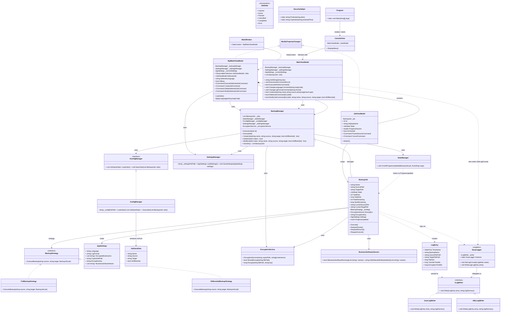

```mermaid
classDiagram
    %% Core / Manager
    class BackupManager {
        - List~BackupJob~ _jobs
        - StateManager _stateManager
        - IConfigManager _configManager
        - SettingsManager _settingsManager
        - EncryptionService _encryptionService
        + ExecuteJob(int id)
        + ExecuteAll()
        + CreateJob(string name, string source, string target, bool isDifferential) bool
        + DeleteJob(int index) bool
        + ModifyJob(int index, string name, string source, string target, bool isDifferential) bool
        + GetJobs() List~BackupJob~
    }

    class BackupJob {
        + string Name
        + string SourcePath
        + string TargetPath
        + JobState State
        + int TotalFiles
        + long TotalSize
        + int FilesRemaining
        + long SizeRemaining
        + string CurrentSourceFile
        + string CurrentTargetFile
        - IBackupStrategy _strategy
        + EncryptionService Encryption
        + string EncryptionKey
        + AppSettings Settings
        + event ProgressUpdated
        + Execute()
        + RequestPause()
        + RequestResume()
        + RequestCancel()
    }

    %% Strategy
    class IBackupStrategy <<interface>> {
        + ExecuteBackup(string source, string target, BackupJob job)
    }
    class FullBackupStrategy { + ExecuteBackup(string source, string target, BackupJob job) }
    class DifferentialBackupStrategy { + ExecuteBackup(string source, string target, BackupJob job) }
    IBackupStrategy <|.. FullBackupStrategy
    IBackupStrategy <|.. DifferentialBackupStrategy

    %% Config / Settings / State
    class IConfigManager <<interface>> { + List~JobSaveData~ LoadJobs() + void SaveJobs(List~BackupJob~ jobs) }
    class ConfigManager { - string _configFilePath + LoadJobs() List~JobSaveData~ + SaveJobs(List~BackupJob~ jobs) }
    IConfigManager <|.. ConfigManager

    class SettingsManager { - string _settingsFilePath + AppSettings LoadSettings() + void SaveSettings(AppSettings settings) }
    class AppSettings { 
        + string Language 
        + string LogFormat 
        + List~string~ EncryptedExtensions 
        + string CryptoSoftPath 
        + string EncryptionKey 
        + List~string~ BusinessSoftwareName 
        }
    class JobSaveData { 
        + string Name 
        + string Source 
        + string Target 
        + bool IsDifferential 
        }
    class StateManager { 
        + void OnJobProgressUpdated(BackupJob job, EventArgs args) }
    class JobState <<enumeration>> { 
        + Inactive 
        + Active 
        + Paused 
        + Cancelled 
        + Completed 
        + Error
         }

    %% Encryption / Security / Business check
    class EncryptionService { 
        + EncryptionService(string cryptoPath, string[] extensions) 
        + bool ShouldEncrypt(string filePath) 
        + long Encrypt(string filePath, string key) 
        }
    class SecurityHelper { 
        + static string Protect(string plain)
         + static string Unprotect(string protectedText) }
    class BusinessSoftwareService { + bool IsBusinessSoftwareRunning(List~string~ names) + string GetDetectedSoftwareName(List~string~ names) }

    %% Logging
    class EasyLogger <<singleton>> {
        - ILogWriter _writer
        + static EasyLogger Instance
        + void SetLogFormat(ILogWriter writer)
        + void WriteLog(LogEntry entry)
    }
    class ILogWriter <<interface>> { + void Write(LogEntry entry, string logDirectory) }
    class JsonLogWriter { + void Write(LogEntry entry, string logDirectory) }
    class XMLLogWriter { + void Write(LogEntry entry, string logDirectory) }
    ILogWriter <|.. JsonLogWriter
    ILogWriter <|.. XMLLogWriter

    class LogEntry {
        + DateTime Timestamp
        + string BackupName
        + string SourceFilePath
        + string TargetFilePath
        + long FileSize
        + long TransferTimeMs
        + long EncryptionTimeMs
    }

    %% UI : Console + WPF
    class ConsoleView { 
        - MainViewModel _viewModel 
        + DisplayMenu() }
    class Program { + static void Main(string[] args) }
    class MainViewModel {
        - BackupManager _backupManager
        - SettingsManager _settingsManager
        - AppSettings _currentSettings
        + List~BackupJob~ Jobs
        + string GetString(string key)
        + void ExecuteJobCommand(int id)
        + bool ExecuteAllJobsCommand()
        + void ChangeLanguageCommand(string langCode)
        + void ChangeLogFormatCommand(string format)
        + bool CreateJob(string name,string source,string target,bool type)
        + bool DeleteJobCommand(int jobId)
        + bool ModifyJobCommand(int jobId, string name, string source, string target, bool isDifferential)
    }
    %% UI : WPF MVVM
    class WpfMainViewModel {
        - BackupManager _backupManager
        - SettingsManager _settingsManager
        - AppSettings _currentSettings
        + ObservableCollection~JobViewModel~ Jobs
        + JobViewModel SelectedJob
        + string SelectedLanguage
        + bool IsBusy
        + ICommand ExecuteSelectedJobCommand
        + ICommand CreateJobCommand
        + ICommand DeleteSelectedJobCommand
        + ICommand ModifySelectedJobCommand
        - LoadJobs()
        - ApplyLanguage(string langCode)
    }

    class JobViewModel {
        - BackupJob _job
        + int Id
        + string DisplayName
        + JobState State
        + double ProgressPercent
        + bool IsChecked
        + ICommand PauseResumeCommand
        + ICommand CancelCommand
        + Detach()
    } 
    class MainWindow { + DataContext : WpfMainViewModel }

    %% Relations
    INotifyPropertyChanged <|.. WpfMainViewModel
    INotifyPropertyChanged <|.. JobViewModel
    WpfMainViewModel "1" *-- "*" JobViewModel : contains
    WpfMainViewModel --> BackupManager : uses
    WpfMainViewModel --> SettingsManager : uses
    JobViewModel --> BackupJob : wraps
    BackupManager "1" o-- "*" BackupJob : manages
    BackupManager --> StateManager : uses
    BackupManager --> IConfigManager : uses
    BackupManager --> SettingsManager : uses
    BackupManager --> EncryptionService : uses

    BackupJob --> IBackupStrategy : strategy
    BackupJob --> EncryptionService : uses
    BackupJob --> BusinessSoftwareService : uses
    BackupJob --> AppSettings : reads
    BackupJob ..> EasyLogger : logs via
    BackupJob ..> LogEntry : creates

    LogEntry ..> ILogWriter : passed to
    EasyLogger --> ILogWriter : delegates to
    MainViewModel ..> EasyLogger : sets writer (SetLogFormat)
    MainViewModel --> BackupManager : uses
    ConsoleView --> MainViewModel : interacts with
    Program --> ConsoleView : creates / starts

    MainWindow --> WpfMainViewModel : DataContext
    WpfMainViewModel --> BackupManager : uses

    ConfigManager --> JobSaveData : serializes to/from
    StateManager ..> BackupJob : listens to ProgressUpdated
```
