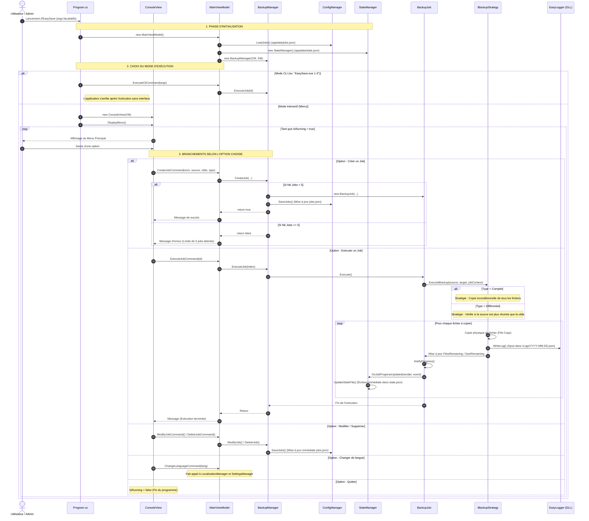

```mermaid
sequenceDiagram
    autonumber
    actor User as Utilisateur / Admin
    participant P as Program.cs
    participant V as ConsoleView
    participant VM as MainViewModel
    participant BM as BackupManager
    participant CM as ConfigManager
    participant SM as StateManager
    participant J as BackupJob
    participant Strat as IBackupStrategy
    participant Log as EasyLogger (DLL)

    User->>P: Lancement d'EasySave (args facultatifs)
    
    Note over P, SM: 1. PHASE D'INITIALISATION
    P->>VM: new MainViewModel()
    VM->>CM: LoadJobs() (appdata/jobs.json)
    VM->>SM: new StateManager() (appdata/state.json)
    VM->>BM: new BackupManager(CM, SM)
    
    Note over P, VM: 2. CHOIX DU MODE D'EXÉCUTION
    alt Mode CLI (ex: "EasySave.exe 1-3")
        P->>VM: ExecuteCliCommand(args)
        VM->>BM: ExecuteJob(id)
        Note right of P: L'application s'arrête après l'exécution sans interface.
        
    else Mode Interactif (Menu)
        P->>V: new ConsoleView(VM)
        P->>V: DisplayMenu()
        
        loop Tant que IsRunning = true
            V-->>User: Affichage du Menu Principal
            User->>V: Saisie d'une option
            
            Note over V, BM: 3. BRANCHEMENTS SELON L'OPTION CHOISIE
            
            alt Option : Créer un Job
                V->>VM: CreateJobCommand(nom, source, cible, type)
                VM->>BM: CreateJob(...)
                alt Si Nb Jobs < 5
                    BM->>J: new BackupJob(...)
                    BM->>CM: SaveJobs() (Mise à jour jobs.json)
                    BM-->>VM: return true
                    VM-->>V: Message de succès
                else Si Nb Jobs >= 5
                    BM-->>VM: return false
                    VM-->>V: Message d'erreur (Limite de 5 jobs atteinte)
                end
                
            else Option : Exécuter un Job
                V->>VM: ExecuteJobCommand(id)
                VM->>BM: ExecuteJob(index)
                BM->>J: Execute()
                J->>Strat: ExecuteBackup(source, target, jobContext)
                
                alt Type = Complet
                    Note over Strat: Stratégie : Copie inconditionnelle de tous les fichiers
                else Type = Différentiel
                    Note over Strat: Stratégie : Vérifie si la source est plus récente que la cible
                end
                
                loop Pour chaque fichier à copier
                    Strat->>Strat: Copie physique du fichier (File.Copy)
                    Strat->>Log: WriteLog() (Ajout dans \Logs\YYYY-MM-DD.json)
                    Strat->>J: Mise à jour FilesRemaining / SizeRemaining
                    J->>J: NotifyProgress()
                    J->>SM: OnJobProgressUpdated(sender, event)
                    SM->>SM: UpdateStateFile() (Écriture immédiate dans state.json)
                end
                J-->>BM: Fin de l'exécution
                BM-->>VM: Retour
                VM-->>V: Message (Exécution terminée)
                
            else Option : Modifier / Supprimer
                V->>VM: ModifyJobCommand() / DeleteJobCommand()
                VM->>BM: ModifyJob() / DeleteJob()
                BM->>CM: SaveJobs() (Mise à jour immédiate jobs.json)
                
            else Option : Changer de langue
                V->>VM: ChangeLanguageCommand(lang)
                Note over VM: Fait appel à LocalizationManager et SettingsManager
                
            else Option : Quitter
                Note over V: IsRunning = false (Fin du programme)
            end
        end
    end
```