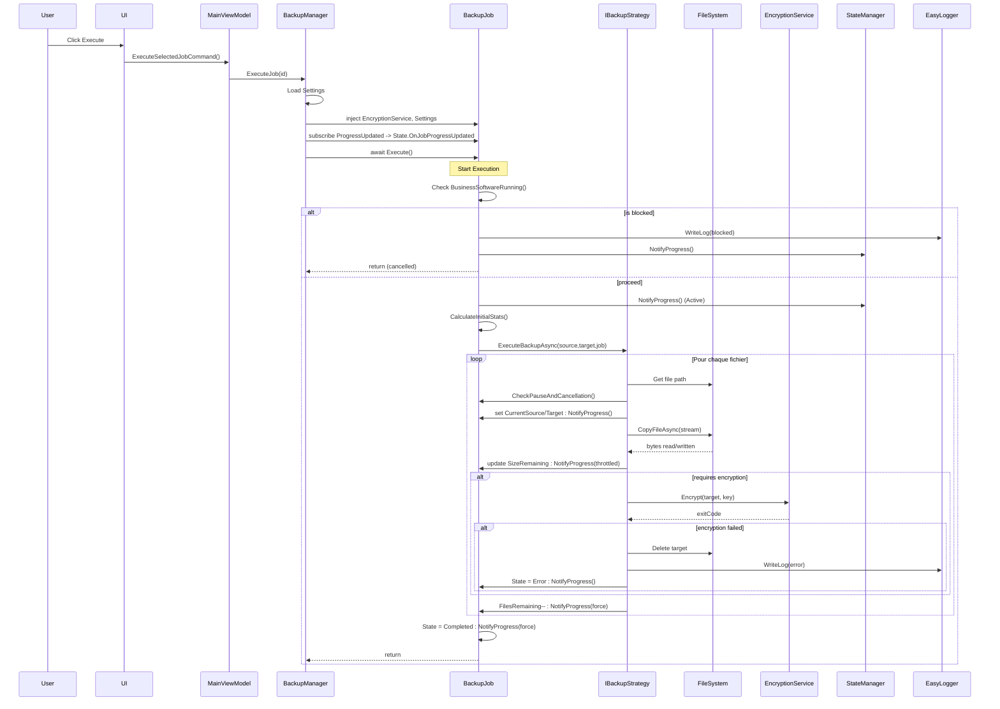

# Sequence Diagram - Backup Execution (Mermaid)

```mermaid
sequenceDiagram
    participant User
    participant UI
    participant MainVM as MainViewModel
    participant BM as BackupManager
    participant Job as BackupJob
    participant Strat as IBackupStrategy
    participant FS as FileSystem
    participant Encrypt as EncryptionService
    participant State as StateManager
    participant Log as EasyLogger

    User->>UI: Click Execute
    UI->>MainVM: ExecuteSelectedJobCommand()
    MainVM->>BM: ExecuteJob(id)
    BM->>BM: Load Settings
    BM->>Job: inject EncryptionService, Settings
    BM->>Job: subscribe ProgressUpdated -> State.OnJobProgressUpdated
    BM->>Job: await Execute()

    Note over Job: Start Execution
    Job->>Job: Check BusinessSoftwareRunning()
    
    alt is blocked
        Job->>Log: WriteLog(blocked)
        Job->>State: NotifyProgress()
        Job-->>BM: return (cancelled)
    else proceed
        Job->>State: NotifyProgress() (Active)
        Job->>Job: CalculateInitialStats()
        Job->>Strat: ExecuteBackupAsync(source,target,job)
        
        loop Pour chaque fichier
            Strat->>FS: Get file path
            Strat->>Job: CheckPauseAndCancellation()
            Strat->>Job: set CurrentSource/Target : NotifyProgress()
            Strat->>FS: CopyFileAsync(stream)
            FS-->>Strat: bytes read/written
            Strat->>Job: update SizeRemaining : NotifyProgress(throttled)
            
            alt requires encryption
                Strat->>Encrypt: Encrypt(target, key)
                Encrypt-->>Strat: exitCode
                alt encryption failed
                    Strat->>FS: Delete target
                    Strat->>Log: WriteLog(error)
                    Strat->>Job: State = Error : NotifyProgress()
                    %% Sortie de la boucle car erreur critique
                end
            end
            Strat->>Job: FilesRemaining-- : NotifyProgress(force)
        end
        
        Job->>Job: State = Completed : NotifyProgress(force)
        Job-->>BM: return
    end
```