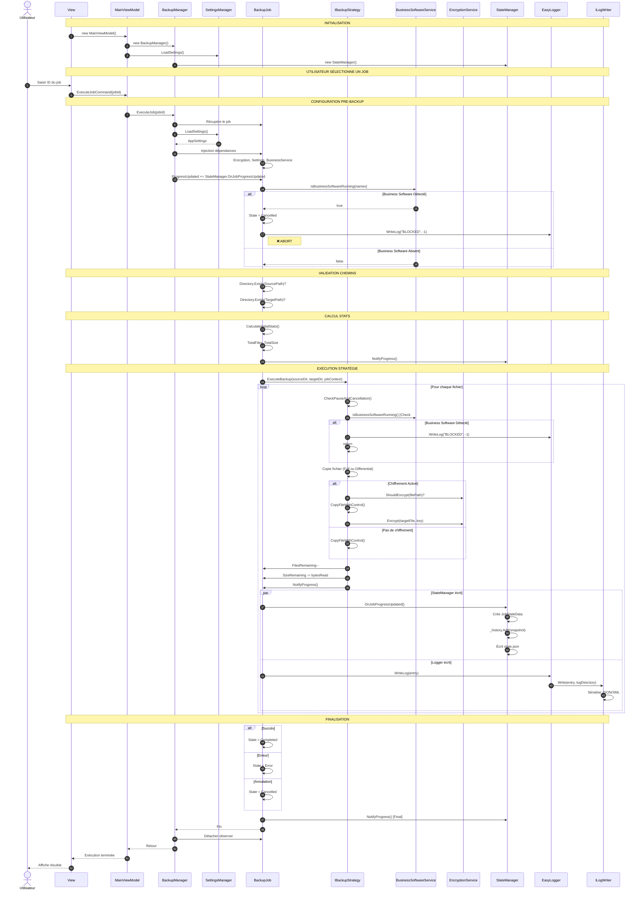

```mermaid
sequenceDiagram
    autonumber
    actor User as Utilisateur
    participant Console as View
    participant VM as MainViewModel
    participant BM as BackupManager
    participant Settings as SettingsManager
    participant Job as BackupJob
    participant Strat as IBackupStrategy
    participant BizSoft as BusinessSoftwareService
    participant Encrypt as EncryptionService
    participant StateM as StateManager
    participant Logger as EasyLogger
    participant LogWriter as ILogWriter

    Note over Console,LogWriter: INITIALISATION
    Console->>VM: new MainViewModel()
    VM->>BM: new BackupManager()
    VM->>Settings: LoadSettings()
    BM->>StateM: new StateManager()

    Note over Console,LogWriter: UTILISATEUR SÉLECTIONNE UN JOB
    User->>Console: Saisir ID du job
    Console->>VM: ExecuteJobCommand(jobId)

    Note over Console,LogWriter: CONFIGURATION PRE-BACKUP
    VM->>BM: ExecuteJob(jobId)
    BM->>Job: Récupère le job
    BM->>Settings: LoadSettings()
    Settings-->>BM: AppSettings

    BM->>Job: Injection dépendances
    Job->>Job: Encryption, Settings, BusinessService
    BM->>Job: ProgressUpdated += StateManager.OnJobProgressUpdated

    Job->>BizSoft: IsBusinessSoftwareRunning(names)
    alt Business Software Détecté
        BizSoft-->>Job: true
        Job->>Job: State = Cancelled
        Job->>Logger: WriteLog("BLOCKED", -1)
        Note right of Job: ❌ ABORT
    else Business Software Absent
        BizSoft-->>Job: false
    end

    Note over Console,LogWriter: VALIDATION CHEMINS
    Job->>Job: Directory.Exists(SourcePath)?
    Job->>Job: Directory.Exists(TargetPath)?

    Note over Console,LogWriter: CALCUL STATS
    Job->>Job: CalculateInitialStats()
    Job->>Job: TotalFiles, TotalSize
    Job->>StateM: NotifyProgress()

    Note over Console,LogWriter: EXÉCUTION STRATÉGIE
    Job->>Strat: ExecuteBackup(sourceDir, targetDir, jobContext)

    loop Pour chaque fichier
        Strat->>Strat: CheckPauseAndCancellation()
        Strat->>BizSoft: IsBusinessSoftwareRunning() [Check #2]
        alt Business Software Détecté
            Strat->>Logger: WriteLog("BLOCKED", -1)
            Strat->>Strat: return
        end

        Strat->>Strat: Copie fichier (Full ou Differential)

        alt Chiffrement Activé
            Strat->>Encrypt: ShouldEncrypt(filePath)?
            Strat->>Strat: CopyFileWithControl()
            Strat->>Encrypt: Encrypt(targetFile, key)
        else Pas de chiffrement
            Strat->>Strat: CopyFileWithControl()
        end

        Strat->>Job: FilesRemaining--
        Strat->>Job: SizeRemaining -= bytesRead
        Strat->>Job: NotifyProgress()

        par StateManager écrit
            Job->>StateM: OnJobProgressUpdated()
            StateM->>StateM: Crée JobStateData
            StateM->>StateM: _history.Add(snapshot)
            StateM->>StateM: Écrit state.json
        and Logger écrit
            Job->>Logger: WriteLog(entry)
            Logger->>LogWriter: Write(entry, logDirectory)
            LogWriter->>LogWriter: Sérialise JSON/XML
        end
    end

    Note over Console,LogWriter: FINALISATION
    alt Succès
        Job->>Job: State = Completed
    else Erreur
        Job->>Job: State = Error
    else Annulation
        Job->>Job: State = Cancelled
    end

    Job->>StateM: NotifyProgress() [Final]
    Job-->>BM: Fin
    BM->>Job: Détacher observer
    BM-->>VM: Retour
    VM-->>Console: Exécution terminée
    Console-->>User: Affiche résultat
```
