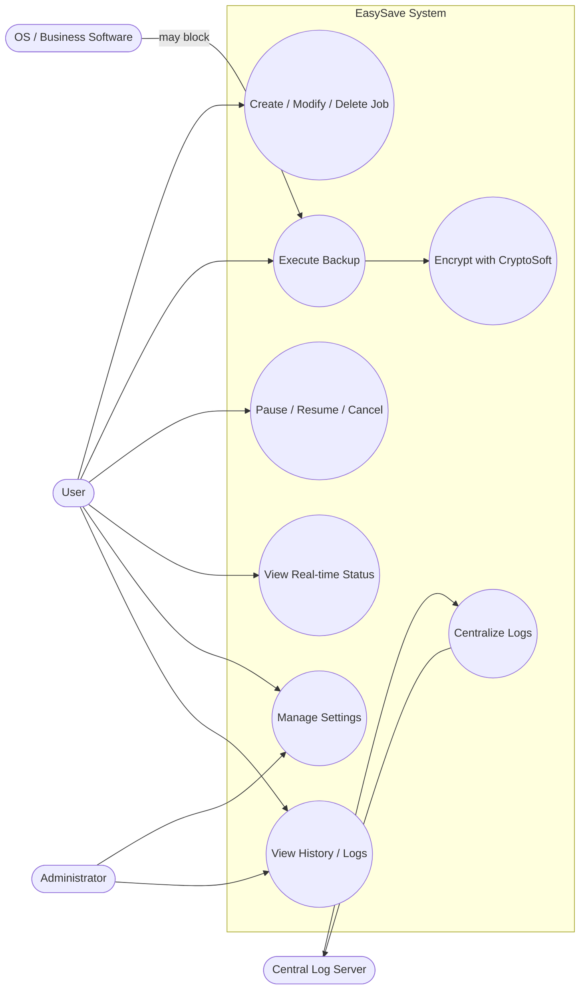

# Use Case Diagram - EasySave

## Actors
- User: local operator using WPF UI or Console CLI
- Central Log Server (Centralizer): Docker service that aggregates logs (optional)
- Operating System / Business Software: external processes that may block backup (e.g., accounting software)
- Administrator: config and monitoring (may be the same as User with privileges)

## Main Use Cases
1. Create / Modify / Delete backup job
2. Execute backup (single, selected, or all)
3. Pause / Resume / Cancel backup
4. View real-time status (UI + state.json)
5. Encrypt files using CryptoSoft
6. Manage settings (language, log format, encrypted extensions, business apps, max size)
7. Centralize logs (Local / Centralized / Both)
8. View history / logs

## Brief descriptions
- Create / Modify / Delete: UI form saves job configuration to appsettings.json and updates UI.
- Execute backup: BackupManager prepares job, injects settings and encryption service, job transitions to Active and Strategy (Full/Differential) performs file-by-file copy.
- Pause / Resume / Cancel: UI sends requests to job; job updates state and emits progress events to StateManager.
- Real-time status: BackupJob emits ProgressUpdated events; StateManager writes state.json; UI binds to JobViewModel for live updates.
- Encryption: After copy, EncryptionService calls external CryptoSoft process and handles errors.
- Log centralization: EasyLogger writes local logs and optionally posts them to the central server via HTTP.

## Mermaid Use Case (flowchart approximation)

